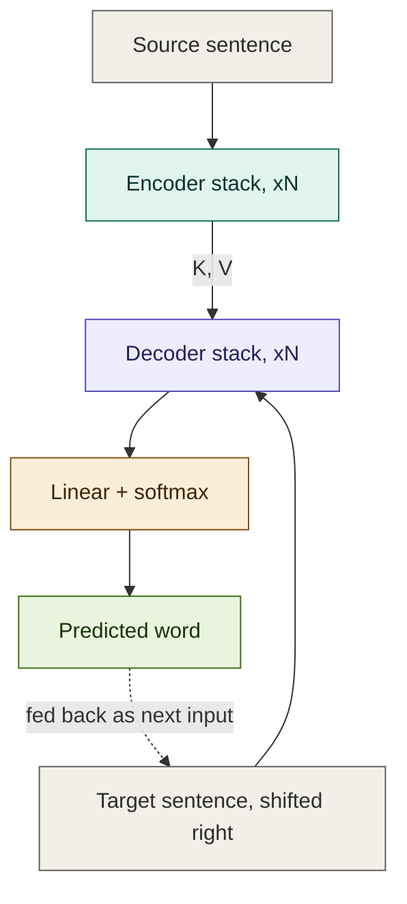
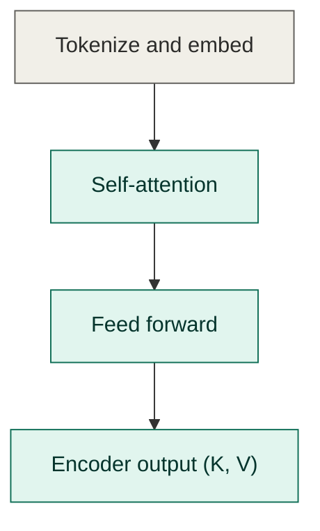
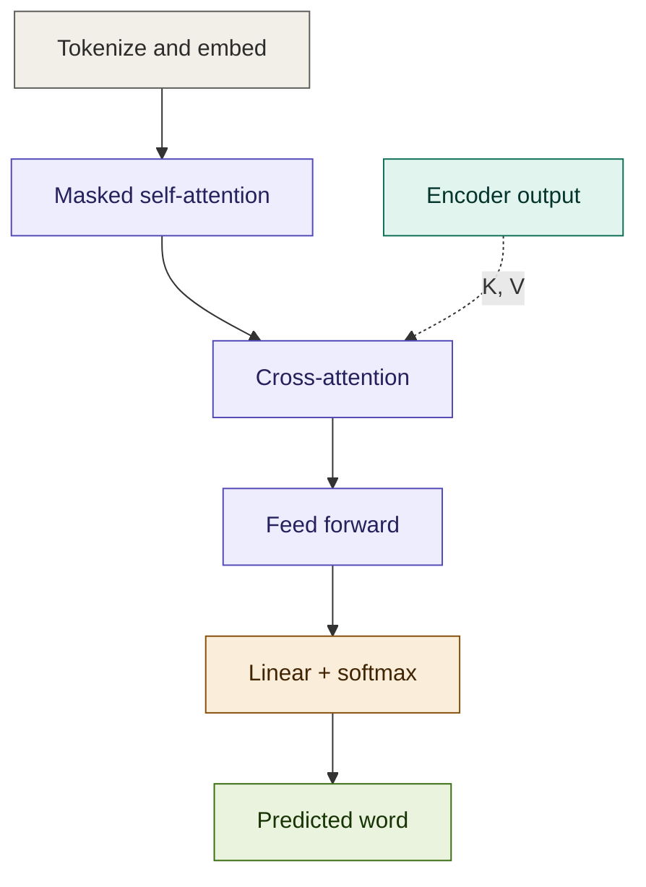
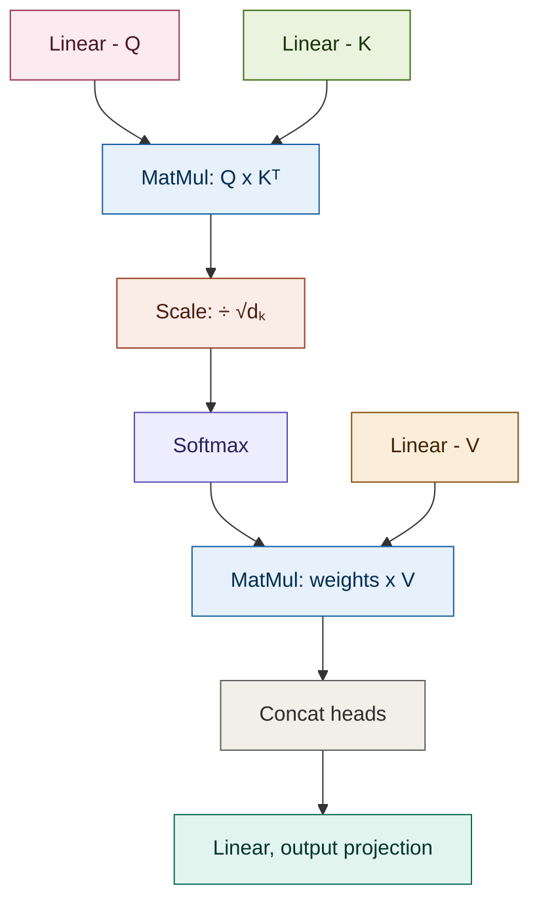
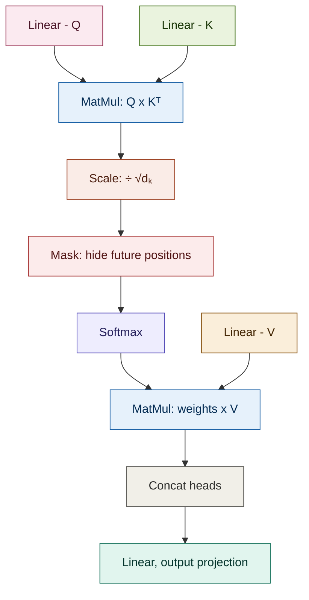

# 🔁 Transformer Architecture — Complete Guide

> From a 30,000-foot workflow diagram down to every formula and number.
> Everything renders natively on GitHub — flowcharts via Mermaid, steps via collapsible sections.

  

---

## 📌 Example Task

Translate an **English sentence (encoder input)** → **Tamil sentence (decoder target)**

| | Sentence | Word count |
|---|---|---|
| **Source (English)** | `"I am going to the market today"` | 7 |
| **Target (Tamil)** | `"நான் இன்று சந்தைக்கு செல்கிறேன்"` | 4 |

**Toy dimensions used throughout:** `d_model = 4`, `num_heads = 2`, `d_k = 2`, `vocab_size = 6`
*(Real models use `d_model=512`, `8 heads`, `d_k=64`, `vocab=30k–50k` — same formulas, bigger numbers)*

---

## 📑 Table of Contents

- [1. Workflow overview](#1-workflow-overview)
- [2. Encoder stack, zoomed in](#2-encoder-stack-zoomed-in)
- [3. Decoder stack, zoomed in](#3-decoder-stack-zoomed-in)
- [4. Multi-head attention, internals](#4-multi-head-attention-internals)
- [5. Masked multi-head attention, internals](#5-masked-multi-head-attention-internals)
- [6. Full step-by-step encoder pipeline](#6-full-step-by-step-encoder-pipeline)
- [7. Full step-by-step decoder pipeline](#7-full-step-by-step-decoder-pipeline)
- [8. Quick formula reference sheet](#8-quick-formula-reference-sheet)

---

## 1. Workflow overview

The source sentence goes into the encoder stack. The target sentence, shifted right by one word, goes into the decoder stack. The encoder finishes, hands its output over as **K and V** to every decoder layer, and the decoder finally produces a probability over the vocabulary — one word at a time, feeding each predicted word back in as the next input.



**Color key:** gray = raw input/output · teal = encoder · purple = decoder · amber = final projection · green = result

---

## 2. Encoder stack, zoomed in

Four moves, repeated N times: turn words into vectors, let every word look at every other word, transform each word individually, then hand the result off as context.



| Stage | What happens | Sees |
|---|---|---|
| Tokenize and embed | Word → vector, plus a positional signal | itself only |
| Self-attention | Every word blends in context from every other word | the whole sentence, both directions |
| Feed forward | A small MLP reshapes each word's vector independently | itself only |
| Encoder output | Final context vectors, reused as K and V by every decoder layer | — |

---

## 3. Decoder stack, zoomed in

Same idea as the encoder, plus one extra move: **cross-attention**, where the decoder checks back on what the encoder produced. And its self-attention is *masked* — a word is never allowed to look ahead at words it hasn't generated yet.



| Stage | What happens | Sees |
|---|---|---|
| Tokenize and embed | Word → vector, plus a positional signal | itself only |
| Masked self-attention | Each word blends context from itself and earlier words only | past words, never future ones |
| Cross-attention | Each decoder word checks the full encoder output | the entire source sentence |
| Feed forward | Per-word MLP, same as encoder | itself only |
| Linear + softmax | Projects to vocabulary size, turns scores into probabilities | — |
| Predicted word | `argmax` of the probability distribution | — |

---

## 4. Multi-head attention, internals

This is what's inside every "self-attention" and "cross-attention" box above. Three separate linear layers turn the input into Query, Key, and Value; Q and K decide *how much* attention to pay; V supplies *what* gets passed through.



**In words:** score every word-pair with `Q · Kᵀ`, scale it down so gradients stay stable, turn scores into a probability distribution with softmax, use those probabilities to take a weighted average of V, then merge all the attention heads back together and project once more.

> In the **encoder**, Q, K, and V all come from the same sentence.
> In **cross-attention**, Q comes from the decoder, but K and V come from the encoder's output — that's how the decoder "looks back" at the source sentence.

---

## 5. Masked multi-head attention, internals

Identical to above, with exactly one extra step: a **Mask**, inserted right before softmax, that blocks every position from seeing anything after itself.



**Why the mask exists:** during training, the decoder sees the entire target sentence at once for efficiency — but if word 3 could peek at word 5's real value, it would just learn to copy the answer instead of learning to predict it. The mask sets every future score to `-∞` before softmax, so those positions collapse to exactly `0` probability. A word can only ever attend to itself and what came before it.

```
masked_scores[i][j] = scores[i][j]   if j ≤ i
                     = -∞             if j > i
```

---

## 6. Full step-by-step encoder pipeline

<details>
<summary><b>Step 1 — Input Sentence</b></summary>

- **Input:** `"I am going to the market today"`
- **Output:** Raw text string, unchanged, sent to tokenizer

</details>

<details>
<summary><b>Step 2 — Tokenization (BPE)</b></summary>

- **Input:** `"I am going to the market today"`
- **Formula/Process:** Byte-Pair merge of frequent sub-word pairs
- **Output (example token IDs):**

  ```
  [I]=12, [am]=45, [going]=56, [to]=33, [the]=8, [market]=91, [today]=64
  → [12, 45, 56, 33, 8, 91, 64]
  ```

- **Shape:** `(seq_len=7,)`

</details>

<details>
<summary><b>Step 3 — Input Embedding</b></summary>

- **Input:** `[12, 45, 56, 33, 8, 91, 64]`
- **Formula:** Each token ID looked up in embedding table `E ∈ ℝ^(vocab_size × d_model)`

  ```
  x_i = E[token_id_i]
  ```

- **Output (toy example, d_model=4):**

  | Token | Embedding |
  |---|---|
  | I | `[0.10, 0.20, 0.05, 0.30]` |
  | am | `[0.15, 0.10, 0.25, 0.05]` |
  | going | `[0.22, 0.18, 0.12, 0.09]` |
  | to | `[0.05, 0.35, 0.02, 0.15]` |
  | the | `[0.28, 0.02, 0.19, 0.11]` |
  | market | `[0.12, 0.24, 0.31, 0.08]` |
  | today | `[0.19, 0.07, 0.14, 0.26]` |

- **Shape:** `(seq_len=7, d_model=4)`

</details>

<details>
<summary><b>Step 4 — Positional Encoding (Sine/Cosine)</b></summary>

- **Input:** Embedding matrix `(7, 4)`
- **Formula:**

  ```
  PE(pos, 2i)   = sin( pos / 10000^(2i/d_model) )
  PE(pos, 2i+1) = cos( pos / 10000^(2i/d_model) )
  ```

  where `pos` = position of word in sentence (0,1,2,...,6), `i` = dimension index pair

- **Worked calculation for pos=1 ("am"), d_model=4 (dims 0,1,2,3):**

  ```
  dim 0 (2i=0, i=0):  sin(1 / 10000^(0/4)) = sin(1/1)   = sin(1)    = 0.8415
  dim 1 (2i+1=1,i=0):  cos(1 / 10000^(0/4)) = cos(1/1)   = cos(1)    = 0.5403
  dim 2 (2i=2, i=1):  sin(1 / 10000^(2/4)) = sin(1/100) = sin(0.01) = 0.0100
  dim 3 (2i+1=3,i=1):  cos(1 / 10000^(2/4)) = cos(1/100) = cos(0.01) = 0.9999
  ```

  `PE(pos=1) = [0.8415, 0.5403, 0.0100, 0.9999]`

- **Full table for all 7 positions** (exact sin/cos values):

  | pos | dim0 `sin(pos)` | dim1 `cos(pos)` | dim2 `sin(pos/100)` | dim3 `cos(pos/100)` |
  |---|---|---|---|---|
  | 0 (I) | 0.0000 | 1.0000 | 0.0000 | 1.0000 |
  | 1 (am) | 0.8415 | 0.5403 | 0.0100 | 0.9999 |
  | 2 (going) | 0.9093 | -0.4161 | 0.0200 | 0.9998 |
  | 3 (to) | 0.1411 | -0.9900 | 0.0300 | 0.9996 |
  | 4 (the) | -0.7568 | -0.6536 | 0.0400 | 0.9992 |
  | 5 (market) | -0.9589 | 0.2837 | 0.0500 | 0.9988 |
  | 6 (today) | -0.2794 | 0.9602 | 0.0600 | 0.9982 |

- **Add to embedding:**

  ```
  final_input = x_i + PE(pos_i)
  ```

- **Output:** `(seq_len=7, d_model=4)` — position-aware embeddings

</details>

<details>
<summary><b>Step 5 — Linear Projection into Q, K, V</b></summary>

- **Input:** `X (7, 4)` (from Step 4)
- **Formula:**

  ```
  Q = X · W_Q      W_Q ∈ ℝ^(d_model × d_model)
  K = X · W_K      W_K ∈ ℝ^(d_model × d_model)
  V = X · W_V      W_V ∈ ℝ^(d_model × d_model)
  ```

- **Output:** Q, K, V each `(7, 4)`

</details>

<details>
<summary><b>Step 6 — Split into Heads</b></summary>

- **Input:** Q, K, V each `(7, 4)`
- **Process:** reshape `d_model=4` into `num_heads=2 × d_k=2`
- **Output:** Q, K, V each `(heads=2, seq_len=7, d_k=2)`

</details>

<details>
<summary><b>Step 7 — MatMul: Q × Kᵀ</b></summary>

- **Input:** Q `(7, 2)`, K `(7, 2)` per head
- **Formula:** `scores = Q · Kᵀ`
- **Output:** raw score matrix `(7, 7)` per head — every word's raw score vs every other word

</details>

<details>
<summary><b>Step 8 — Scale</b></summary>

- **Input:** `scores (7, 7)`
- **Formula:**

  ```
  scaled_scores = scores / √d_k     ( √2 ≈ 1.414 in toy example, √64 in real model )
  ```

- **Output:** `(7, 7)`, same shape, smaller magnitude (keeps gradients stable)

</details>

<details>
<summary><b>Step 9 — Softmax (row-wise)</b></summary>

- **Input:** `scaled_scores (7, 7)`
- **Formula:**

  ```
  softmax(zᵢ) = e^(zᵢ) / Σⱼ e^(zⱼ)
  ```

- **Example output for "market" attending to `[I, am, going, to, the, market, today]`:**
  → "market" pays most attention to "going" and "today" (context words), less to function words like "to"/"the"

  ```
  attention_weights("market") = [0.05, 0.05, 0.25, 0.05, 0.05, 0.30, 0.25]   (sums to 1.0)
  ```

- **Output:** `(7, 7)` attention weight matrix per head

</details>

<details>
<summary><b>Step 10 — MatMul: weights × V</b></summary>

- **Input:** attention weights `(7, 7)` + V `(7, 2)`
- **Formula:** `Attention(Q,K,V) = softmax(QKᵀ/√d_k) · V`
- **Output:** `(7, 2)` per head — context-aware vector for each word

</details>

<details>
<summary><b>Step 11 — Concatenate Heads</b></summary>

- **Input:** 2 heads × `(7, 2)`
- **Output:** `(7, 4)` — back to full d_model

</details>

<details>
<summary><b>Step 12 — Final Linear Projection (W_O)</b></summary>

- **Input:** `(7, 4)`
- **Formula:** `output = concat(heads) · W_O`
- **Output:** `(7, 4)` — final self-attention output

</details>

<details>
<summary><b>Step 13 — Add & Norm (Residual + LayerNorm)</b></summary>

- **Input:** attention output `(7,4)` + original input from Step 4 `(7,4)`
- **Formula:**

  ```
  LayerNorm( x + Sublayer(x) )
  where LayerNorm(z) = γ · (z - μ)/√(σ² + ε) + β
  μ = mean(z), σ² = variance(z)
  ```

- **Output:** `(7, 4)`, mean≈0, variance≈1 per row, then rescaled by learnable γ, β

</details>

<details>
<summary><b>Step 14 — Feed Forward NN</b></summary>

- **Input:** `(7, 4)`
- **Formula:** *(real model: 512 → 2048 → 512; toy: 4 → 16 → 4)*

  ```
  FFN(x) = max(0, x·W1 + b1)·W2 + b2      (ReLU activation)
  ```

- **Output:** `(7, 4)`

</details>

<details open>
<summary><b>Step 15 — Add & Norm → ENCODER OUTPUT ✅</b></summary>

- **Input:** FFN output `(7,4)` + Step 13 output `(7,4)`
- **Formula:** same LayerNorm formula as Step 13
- **Output (final encoder output, toy example):**

  | Token | Encoder Output |
  |---|---|
  | E_I | `[0.42, -0.18, 0.55, 0.10]` |
  | E_am | `[0.30, 0.25, -0.12, 0.40]` |
  | E_going | `[0.20, 0.15, 0.33, -0.08]` |
  | E_to | `[0.11, 0.38, -0.05, 0.22]` |
  | E_the | `[0.27, -0.02, 0.19, 0.14]` |
  | E_market | `[0.15, 0.29, 0.31, 0.06]` |
  | E_today | `[0.24, 0.09, 0.17, 0.28]` |

- **Shape:** `(seq_len=7, d_model=4)` — this feeds Cross-Attention as **K and V** for every decoder layer

</details>

---

## 7. Full step-by-step decoder pipeline

<details>
<summary><b>Step 16 — Target Input (shifted right)</b></summary>

- **Target sentence:** `"நான் இன்று சந்தைக்கு செல்கிறேன்"` → shifted: `[<SOS>, நான், இன்று, சந்தைக்கு]` (predicting one word at a time)
- **Token IDs (example):** `[<SOS>=1, நான்=23, இன்று=41, சந்தைக்கு=52]`
- **Shape:** `(tgt_len=4,)`

</details>

<details>
<summary><b>Step 17 — Output Embedding</b></summary>

- **Formula:** same lookup as Step 3: `x_i = E[token_id_i]`
- **Output:** `(4, 4)`

</details>

<details>
<summary><b>Step 18 — + Positional Encoding</b></summary>

- **Formula:** identical sin/cos formula from Step 4, evaluated at `pos = 0,1,2,3`
- **Output:** `(4, 4)`

</details>

<details>
<summary><b>Step 19 — Q, K, V Projection (decoder's own)</b></summary>

- **Formula:** `Q = X·W_Q`, `K = X·W_K`, `V = X·W_V` (decoder's own weight matrices)
- **Output:** Q, K, V each `(4, 4)` → split heads → `(2 heads, 4, 2)`

</details>

<details>
<summary><b>Step 20 — MatMul Q×Kᵀ, then Scale</b></summary>

- **Formula:** `scores = (Q·Kᵀ) / √d_k`
- **Output:** `(4, 4)` per head

</details>

<details>
<summary><b>Step 21 — Masking (the extra step vs encoder)</b></summary>

- **Formula:**

  ```
  masked_scores[i][j] = scores[i][j]   if j ≤ i
                       = -∞             if j > i
  ```

- **Example matrix (4×4, row=query pos, col=key pos):**

  |  | `<SOS>` | நான் | இன்று | சந்தைக்கு |
  |---|---|---|---|---|
  | **`<SOS>`** | 0.5 | -∞ | -∞ | -∞ |
  | **நான்** | 0.3 | 0.6 | -∞ | -∞ |
  | **இன்று** | 0.2 | 0.4 | 0.7 | -∞ |
  | **சந்தைக்கு** | 0.1 | 0.3 | 0.5 | 0.8 |

- **Output:** `(4, 4)`, upper-right triangle = `-∞` — a word can never look ahead at words it hasn't generated yet

</details>

<details>
<summary><b>Step 22 — Softmax</b></summary>

- **Formula:** `softmax(zᵢ) = e^(zᵢ)/Σⱼe^(zⱼ)` (the `-∞` becomes exactly `0`)
- **Example result:**

  |  | `<SOS>` | நான் | இன்று | சந்தைக்கு |
  |---|---|---|---|---|
  | **`<SOS>`** | 1.00 | 0.00 | 0.00 | 0.00 |
  | **நான்** | 0.40 | 0.60 | 0.00 | 0.00 |
  | **இன்று** | 0.20 | 0.30 | 0.50 | 0.00 |
  | **சந்தைக்கு** | 0.10 | 0.20 | 0.30 | 0.40 |

- **Output:** `(4, 4)` — each word attends only to itself and words before it; nothing attends to the future

</details>

<details>
<summary><b>Step 23 — MatMul weights × V, Concat, Final Linear</b></summary>

- **Formula:** same as Steps 10-12
- **Output:** `(4, 4)` — masked self-attention output

</details>

<details>
<summary><b>Step 24 — Add & Norm</b></summary>

- **Formula:** `LayerNorm(x + Sublayer(x))`
- **Output:** `(4, 4)` — this becomes **Query** for Cross-Attention

</details>

<details open>
<summary><b>Step 25 — Cross-Attention 🔗 (encoder meets decoder)</b></summary>

- **Input:** Query from Step 24 `(4, 4)` [decoder] + Key, Value from Step 15 `(7, 4)` [encoder output]
- **Formula:** `CrossAttn(Q,K,V) = softmax(Q·Kᵀ/√d_k)·V`
  - Q comes from decoder → shape `(4, d_k)`
  - K, V come from encoder → shape `(7, d_k)`
  - `Q·Kᵀ` → `(4, 7)` — each target word scores against all 7 source words
- **Example:** "சந்தைக்கு" (meaning "to the market") gets its highest attention weight on encoder's `E_market` vector, with secondary weight on `E_to`
- **Output:** `(4, 4)` — decoder length preserved, content infused with source sentence context

</details>

<details>
<summary><b>Step 26 — Add & Norm</b></summary>

- **Output:** `(4, 4)`

</details>

<details>
<summary><b>Step 27 — Feed Forward NN</b></summary>

- **Formula:** `FFN(x) = max(0, x·W1+b1)·W2+b2`
- **Output:** `(4, 4)`

</details>

<details>
<summary><b>Step 28 — Add & Norm → Final Decoder Output</b></summary>

- **Output:** `(4, 4)`

</details>

<details>
<summary><b>Step 29 — Linear Layer</b></summary>

- **Formula:** `logits = x · W_vocab + b`, `W_vocab ∈ ℝ^(d_model × vocab_size)`
- **Input:** `(4, 4)`
- **Output:** `(4, vocab_size=6)` — e.g. for the last position ("சந்தைக்கு" processed), scores per vocab word:

  ```
  logits = [0.4, 1.1, 0.2, 0.9, 3.6, 1.8]
  ```

</details>

<details>
<summary><b>Step 30 — Softmax</b></summary>

- **Formula:** `softmax(zᵢ) = e^(zᵢ)/Σⱼe^(zⱼ)`
- **Output (probabilities for that position):**

  ```
  probs = [0.02, 0.05, 0.02, 0.04, 0.79, 0.08]
  ```

</details>

<details open>
<summary><b>Step 31 — Predicted Word (Final Output) 🎯</b></summary>

- **Formula:** `predicted_token = argmax(probs)`
- **Output:** index 4 → **"செல்கிறேன்"** (highest probability = 0.79)
- **Full decoder output so far:** `<SOS> → நான் → இன்று → சந்தைக்கு → செல்கிறேன்`
- **Loop:** "செல்கிறேன்" fed back as next decoder input → model predicts `<EOS>` next → sentence complete:
  **"நான் இன்று சந்தைக்கு செல்கிறேன்"** *(I am going to the market today)*

</details>

---

## 8. Quick formula reference sheet

| Component | Formula |
|---|---|
| Positional Encoding | `PE(pos,2i)=sin(pos/10000^(2i/d_model))`, `PE(pos,2i+1)=cos(pos/10000^(2i/d_model))` |
| Q, K, V projection | `Q=XW_Q`, `K=XW_K`, `V=XW_V` |
| Attention score | `scores = QKᵀ` |
| Scaling | `scaled = scores/√d_k` |
| Masking (decoder only) | `masked[i][j] = -∞ if j>i else scores[i][j]` |
| Softmax | `softmax(zᵢ) = e^zᵢ / Σⱼ e^zⱼ` |
| Full attention | `Attention(Q,K,V) = softmax(QKᵀ/√d_k)·V` |
| Add & Norm | `LayerNorm(x + Sublayer(x))`, `LayerNorm(z)=γ(z-μ)/√(σ²+ε)+β` |
| Feed Forward | `FFN(x) = max(0, xW1+b1)W2+b2` |
| Final Linear | `logits = xW_vocab + b` |
| Prediction | `argmax(softmax(logits))` |

---

<p align="center"><i>📖 Toy walkthrough for learning purposes — swap in real trained weight matrices (W_Q, W_K, W_V, W_O, W1, W2, W_vocab) to run this end-to-end in PyTorch/TensorFlow.<br>Mermaid diagrams render natively on GitHub — no extra setup needed.</i></p>
